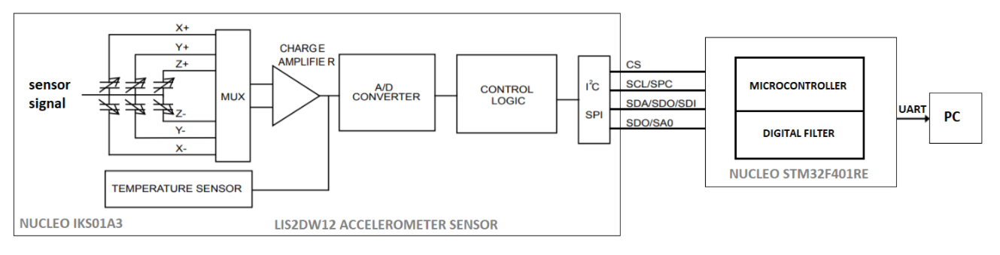

# STM32_Temple_Run_Controller
STM32_Temple_Run_Controller: Using a Sensors Shield Nucleo IKS01A3 connected to the board Nucleo STM32F401RE as a joystick to play the game Temple Run 2.

Temple Run 2 is an online video game based on an endless runner that has to dodge obstacles
increasing the traveled distance and so the score

The scheme of the data acquisition system is:

